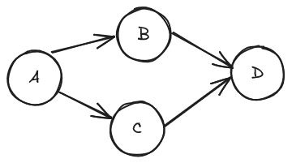

# Cycle detection
For actual codes, see the leetcode problems below.

## Directed Graph

* [207. Course Schedule](../../../Leetcode/0207-CourseSchedule/README.md)

### DFS
Time complexity: O(V*E)
Space complexity: O(V)

Compared to a typical DFS, cycle detection algorithm maintains a current DFS traversal path. This is usually done by creating a hash map(or array) `onPath`. When we visit a node, set `onPath[node] = true`; when we leave a node, set `onPath[node] = false`. If we're trying to visit a node, but it's already on path, this means: we've reached that node before, but there's a cycle in the graph which leads us back to the node again. In other words, a cycle has been detected.

Why is `visited` not enough? Because in directed graph, revisiting a node doesn't necessarily mean there's a cycle: it might mean there's another route to this node. In the example below, there's no cycle in the graph. When we finished visiting A->B->D using DFS, we visit A->C->D. You'll find D is already visited, but this doesn't mean there's a cycle.

`onPath` map doesn't conflict with `visited` map. In fact, they're both needed:

* `onPath` records if a node is on current DFS traversal path. If yes, a cycle has been detected.
* `visited` records if a node has been visited before. If yes, simply skip it.

Note that `onPath` needs to be checked before `visited`(because if a node is onPath, clearly it was visited before).

### BFS
It's not recommended to use plain BFS to do cycle detection for directed graph. Although it's possible to maintain a path during BFS traversal(you'll have to push each path to the queue), it's cumbersome and space-inefficient to do so.

We can use Kahn’s Algorithm(which is used for topological sorting) to do cycle detection: tracking the indegrees of each node, and push those with 0 indegrees into queue. When the queue becomes empty, if not all nodes are visited, it means there's a cycle in the graph.

Time complexity: O(V+E)
Space complexity: O(V)

## Undirected Graph
Leetcode problems:

* [261. Graph Valid Tree](../../../Leetcode/0261-GraphValidTree/README.md)

### DFS(DFS + parent + onPath)
Undirected graph is a bit more complicated than directed graph, becuase it contains "trivial cycles" like `A -> B -> A`. For example: when we're visiting A, of course `visited[A] = true` and `onPath[A] = true`. Next, we proceed to visit B. However, when we're visiting all neighbors of B, we'll find A is a neighbor of B as well, and A is already on path. But it's not actually a cycle, it's just an undirected edge. **We need a way to skip A when visiting all neighbors of B.**

To achieve this, we add a `parent` parameter to the DFS function, which is the previous node we've visited in the path. When we visit B, `parent = A`. When visiting all neighbors of B, we skip `parent = A` to avoid trivial cycles.

### BFS(BFS + parent)
In undirected graph, revisiting a node indicates cycle. However, we need to handle "trivial cycles" like `A -> B -> A`. Difference from plain BFS:

* When pushing node into queue, push its parent as well.
* When visiting a node's neighbors, skip its parent.
