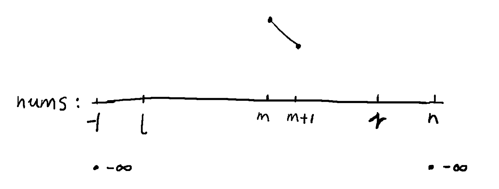

# 162. Find Peak Element
A peak element is an element that is strictly greater than its neighbors.

Given a 0-indexed integer array nums, find a peak element, and return its index. If the array contains multiple peaks, return the index to any of the peaks.

You may imagine that nums[-1] = nums[n] = -∞. In other words, an element is always considered to be strictly greater than a neighbor that is outside the array.

You must write an algorithm that runs in O(log n) time.

Example 1:

Input: nums = [1,2,3,1]
Output: 2
Explanation: 3 is a peak element and your function should return the index number 2.

Example 2:

Input: nums = [1,2,1,3,5,6,4]
Output: 5
Explanation: Your function can return either index number 1 where the peak element is 2, or index number 5 where the peak element is 6.

Constraints:

* 1 <= nums.length <= 1000
* -231 <= nums[i] <= 231 - 1
* nums[i] != nums[i + 1] for all valid i.

## Solution: binary search
First of all, the peak definitely exist, because nums[-1] = nums[n] = -∞. This means any nums[i], 0 <= i < n will be greater than nums[-1] and nums[n].

In binary search, how do we determine whether to continue searching to the left or right? Simply compare nums[mid] and nums[mid+1]. If nums[mid] > nums[mid+1], the elements near mid will look like:

It's pretty clear that there must be at least one peak within range [l, mid], including nums[mid] itself. So we continue searching on the left side.

Otherwise, continue searching on the right side [mid+1, r].