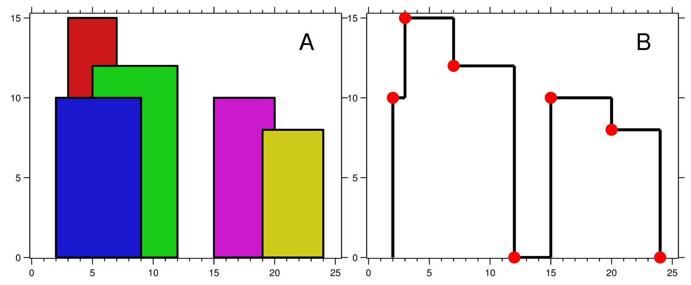

# 218. The Skyline Problem
A city's skyline is the outer contour of the silhouette formed by all the buildings in that city when viewed from a distance. Given the locations and heights of all the buildings, return the skyline formed by these buildings collectively.

The geometric information of each building is given in the array buildings where buildings[i] = [left_i, right_i, height_i]:

    left_i is the x coordinate of the left edge of the ith building.
    right_i is the x coordinate of the right edge of the ith building.
    height_i is the height of the ith building.

You may assume all buildings are perfect rectangles grounded on an absolutely flat surface at height 0.

The skyline should be represented as a list of "key points" sorted by their x-coordinate in the form [[x1,y1],[x2,y2],...]. Each key point is the left endpoint of some horizontal segment in the skyline except the last point in the list, which always has a y-coordinate 0 and is used to mark the skyline's termination where the rightmost building ends. Any ground between the leftmost and rightmost buildings should be part of the skyline's contour.

Note: There must be no consecutive horizontal lines of equal height in the output skyline. For instance, [...,[2 3],[4 5],[7 5],[11 5],[12 7],...] is not acceptable; the three lines of height 5 should be merged into one in the final output as such: [...,[2 3],[4 5],[12 7],...]

Example 1:

Input: buildings = [[2,9,10],[3,7,15],[5,12,12],[15,20,10],[19,24,8]]
Output: [[2,10],[3,15],[7,12],[12,0],[15,10],[20,8],[24,0]]
Explanation:
Figure A shows the buildings of the input.
Figure B shows the skyline formed by those buildings. The red points in figure B represent the key points in the output list.

Example 2:

Input: buildings = [[0,2,3],[2,5,3]]
Output: [[0,3],[5,0]]

Constraints:

* 1 <= buildings.length <= 104
* 0 <= left_i < right_i <= 231 - 1
* 1 <= height_i <= 231 - 1
* buildings is sorted by left_i in non-decreasing order.

## Solution 1: Brute Force 1
The height of the skyline only changes at the edges of buildings. We consider these points as key points. If we uniquify and sort all left and right edges of buildings, we can calculate the height of edge point.

For example 1, its edge points/key points(unsorted) are: 2, 9, 3, 7, 5, 12, 15, 20, 19, 24.

Now we already know the edge point of each building and corresponding heights. We can generate the answers.

## Solution 2: Brute Force II, Sweep Line(easier to understand)
Suppose there's a sweep line moving from left to right. When the sweep line reaches at the edge of a building, we calculate the max height of the position.

Now we already know the edge point of each building and corresponding heights. We can generate the answers.

## Solution 3: Sweep Line + Priority Queue
We can use priority queue to optimize solution 2.

When using the sweep line to scan the buildings, for a specific key point(edge point), we need to know the largest height. In solution 2, we do so by iterating over all the buildings. However, this can be optimized by using priority queue: during scanning, we add buildings we met to PriorityQueue and make sure the largest height is always at heap top, so that we can immediately get the largest height.

In theory, when we reaches the right edge of a building, we need to remove it from the priority queue. However, removing an element from a priority queue takes O(n) and n is the size of the priority queue. So usually we go with the lazy approach: find a way to ignore these invalid elements when popping from priority queues. We can add (height, right) pairs into the priority queue, so that when we pop an element, we can compare "right" with current position to know if this building is still "live". If it's not, simply ignore it and pop another one.