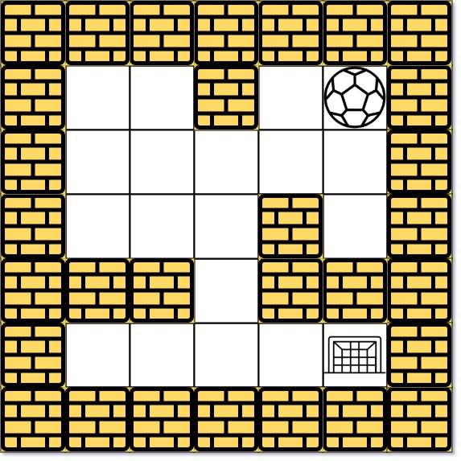

# 490. The Maze
There is a ball in a maze with empty spaces (represented as 0) and walls (represented as 1). The ball can go through the empty spaces by rolling up, down, left or right, but it won't stop rolling until hitting a wall. When the ball stops, it could choose the next direction.

Given the m x n maze, the ball's start position and the destination, where start = [startrow, startcol] and destination = [destinationrow, destinationcol], return true if the ball can stop at the destination, otherwise return false.

You may assume that the borders of the maze are all walls (see examples).

## Example 1

Input: maze = [[0,0,1,0,0],[0,0,0,0,0],[0,0,0,1,0],[1,1,0,1,1],[0,0,0,0,0]], start = [0,4], destination = [4,4]
Output: true
Explanation: One possible way is : left -> down -> left -> down -> right -> down -> right.

# Solution
Consider the maze as a graph. The starting position is its first node. The possible next steps are adjacent nodes.

## Solution 1: DFS
Each round, we calculate the adjacent nodes(left, right, up, down) and recursively do DFS. Note that it's possible that the ball can't move any further on a specific direction.
