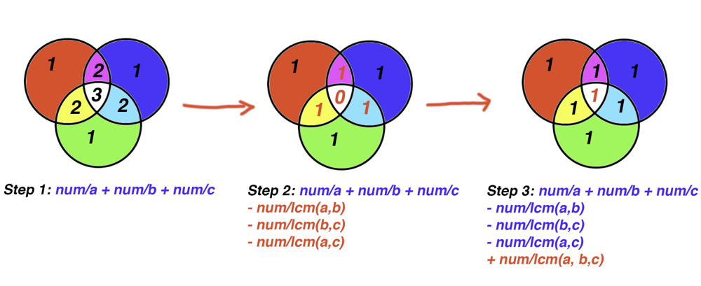

# 1201. Ugly Number III
An ugly number is a positive integer that is divisible by a, b, or c.

Given four integers n, a, b, and c, return the nth ugly number.

Example 1:

Input: n = 3, a = 2, b = 3, c = 5
Output: 4
Explanation: The ugly numbers are 2, 3, 4, 5, 6, 8, 9, 10... The 3rd is 4.

Example 2:

Input: n = 4, a = 2, b = 3, c = 4
Output: 6
Explanation: The ugly numbers are 2, 3, 4, 6, 8, 9, 10, 12... The 4th is 6.

Example 3:

Input: n = 5, a = 2, b = 11, c = 13
Output: 10
Explanation: The ugly numbers are 2, 4, 6, 8, 10, 11, 12, 13... The 5th is 10.

Constraints:

* 1 <= n, a, b, c <= 109
* 1 <= a * b * c <= 1018
* It is guaranteed that the result will be in range [1, 2 * 109].

## Solution
The solution of 264. Ugly Number II will result in "Time Limit Exceeded". We have to find a more efficient solution.

Let sets(集合) A/B/C include all numbers that are divisible by a/b/c.

Let sets AB/BC/AC include all numbers that are divisible by ab/bc/ac.

Let setABC be the set in which all numbers are divisible by abc.

Given a number x, the number of ugly numbers that are less than or equal to x will be:

    A∪B∪C = A + B + C- A∩B - A∩C - B∩C + A∩B∩C

But given a value of x, how do we calculate the size of set A? Set A includes all numbers that are divisible by a. The answer is simple: x / a.

And how to calculate size(A∩B)? First we need to calculate the least common multiplier of a and b: lcm(a, b). Then the answer is simple: x / lcm(a, b). How to calculate lcm of a and b? (a * b) / gcd(a, b).

And size(A∩B∩C)? x / lcm(a, b, c).

Once you understand this, we can quickly calculate the number of ugly numbers which are smaller than x. Clearly, the greater x is, the more ugly numbers there will be; the smaller x is, the less ugly numbers there will be. This means we can do binary search.

It is guaranteed that the result will be in range [1, 2 * 10^9]. So the possible range of x is [1, 2e9]. Let left = 1, right = 2e9+1, and we're doing binary search on range [1, 2e9+1). Each time we calculate a mid value, we use it as x to calculate the number of ugly numbers that are smaller than it. If that number equals n, it means the ugly number we're looking for is close by.

It's similar to use binary search to find the left boundary of an array(with duplicates).