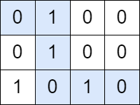

# 2510. Check if There is a Path With Equal Number of 0's And 1's
You are given a 0-indexed m x n binary matrix grid. You can move from a cell (row, col) to any of the cells (row + 1, col) or (row, col + 1).

Return true if there is a path from (0, 0) to (m - 1, n - 1) that visits an equal number of 0's and 1's. Otherwise return false.

Example 1:

Input: grid = [[0,1,0,0],[0,1,0,0],[1,0,1,0]]
Output: true
Explanation: The path colored in blue in the above diagram is a valid path because we have 3 cells with a value of 1 and 3 with a value of 0. Since there is a valid path, we return true.

Example 2:

Input: grid = [[1,1,0],[0,0,1],[1,0,0]]
Output: false
Explanation: There is no path in this grid with an equal number of 0's and 1's.

Constraints:

* m == grid.length
* n == grid[i].length
* 2 <= m, n <= 100
* grid[i][j] is either 0 or 1.

# Solution
Key observation: from (0, 0) to (m-1, n-1), there'll always be m+n-1 steps. If the path has equal number of 0 and 1, it means the sum of all elements in the path is (m+n-1)/2.

## Solution 1: Dynamic Programming
Since we can only go right or down in the grid, and all elements in the grid are non-negative, this usually indicates we can use dynamic programming.

Define dp[i][j][k] as a bool value indicating whether there's a path from (0,0) to (i,j) so that all elements in the path can sum up to k.

* Optimal substructure: When calculating the sum, we can first reach (i-1,j) and (i,j-1), then go to (i,j). This means the problem can be solved by using the result of its subproblems.
* Overlapping subproblems: The subproblem results are repeatedly calculated.

time complexity: O(m*n*(m+n))
space complexity: O(m*n*(m+n))

## Solution 2: Smart dynamic programming
The grid is special: it only contains 0 or 1.

For each path, we can change only 1 element by swapping the elements at the corner. All possible paths can be constructed this way. Since there's only 0 and 1 in the grid, this means: the sums of all paths are continuous. If the path with the max sum has a sum of MAX, and the min sum is MIN, all sums in range [MIN, MAX] exist in the grid. Note that this is true because the grid only contains 0 and 1.

So we can use dynamic programming to calculate the min and max sum from (0, 0) to (m-1, n-1). The target sum we're looking for is `(m+n-1)/2`. If it's within the range, a path with sum of `(m+n-1)/2` does exist(return true).
